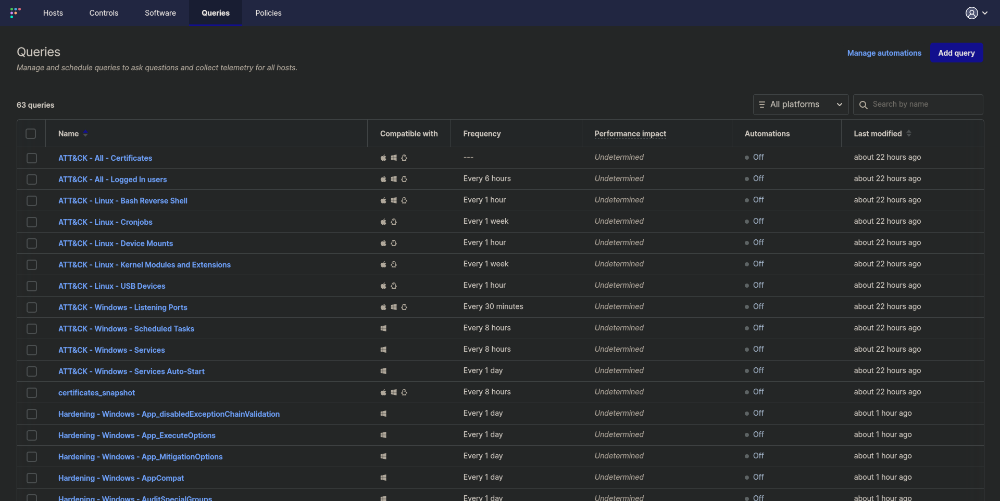
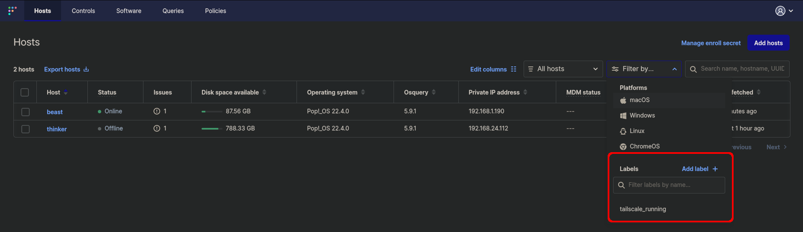
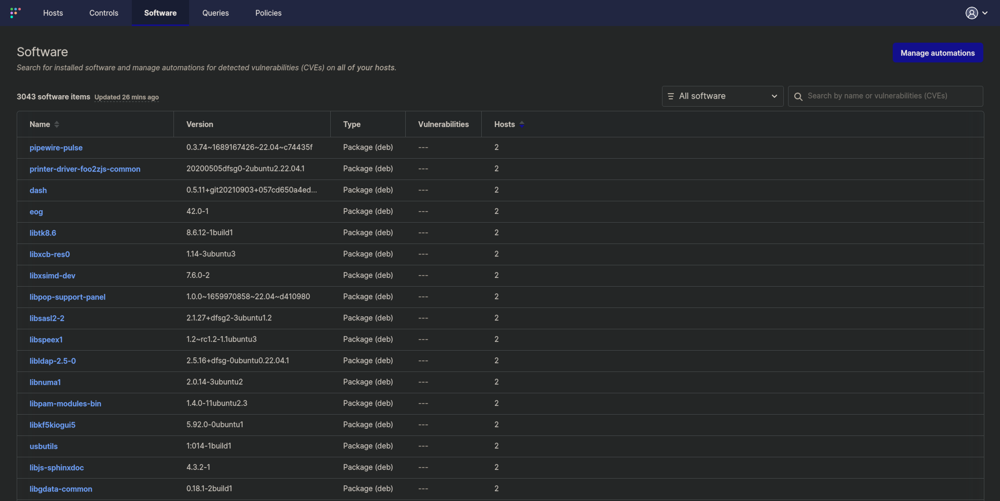

# Kicking the Tires on FleetDM

The purpose of this post is to cover a few things I've learned about [FleetDM](https://fleetdm.com/) (**the community version**), how to extend it with publicly available queries, and any issues I had to tackle. I've stood up a FleetDM server a few times before (_but this time it's different_ /s) but this time I'm using it for research, work practice, and homelab security; I'm hoping to learn a lot and bring what I've learned to work. That said, this blog post may evolve a bit over time and its content may be disorganized.

## FleetDM Server Notes
* Just use CentOS as the instructions recommend. I went with Debian 12 (bookworm) because I wanted to, this lead to database issues which leads to the next point...

* If you use MariaDB (default-mysql-server on Debian) then **you'll have a bad time**.
    * It'll install and configure, but you'll have lots of errors and warnings, I couldn't get anything under _hosts_ to work.
    * Use MySQL as it recommends. If you choose a different server OS you can always stand up MySQL in Docker like I did (I was impatient and stubborn).

* If you use a self-signed TLS certificate (or one generated by mkcert) you'll need to build packages with the `--insecure` flag so that clients don't fail to register and connect.
    * Alternatively, if have a premium license then you could build packages with the `--fleet-tls-client-certificate` and `--fleet-tls-client-key` flags to specify a certificate to use.

* Actually use _fleetctl_. It's very handy for converting osquery conf files into yaml for direct import, as well as the general use and configuration of your FleetDM install.

## Policies
Policies are great for monitoring the compliance of endpoints, and like everything else can be stored as code (yaml files) and applied with a fleetctl command. If you chose to include fleet desktop on your endpoints then any failed policies will be listed in the tray icon and clicking on them will take you to the FleetDM endpoint page to review the findings. These policies usually include a helpful command for remediating the finding.

A great way to get started with Windows CIS policies is to use the provided policies. Note that as long as policy names don't change, you could re-apply this file and it'll update all policy settings.
```bash
cd /tmp/
wget https://raw.githubusercontent.com/fleetdm/fleet/main/ee/cis/win-10/cis-policy-queries.yml
fleetctl apply -f cis-policy-queries.yaml
```


## Queries
Queries have a lot of power; they can be used for security incidents, vulnerability management, IT resource use monitoring, or anything else you can query on. Each of these queries can be configured to run on a schedule, and if you configure logging then you can setup alerts on the query results (like setting up a query for a threat process, configuring Splunk logging, and building an alert).

Another great thing is that you can recycle other public OSQuery, Kolide, and Fleet queries (just like we did above with Policies and the `fleetctl apply` command).
* [OSQuery Packs - Github](https://github.com/osquery/osquery/tree/master/packs)
* [Palantir OSQuery Config - Github](https://github.com/palantir/osquery-configuration)



## Labels
I think this feature is under rated and also a bit hidden. Labels can define hosts statically or dynamically (by query), and can be created from the UI from the _filter by_ drop-down or from a fleetctl command `fleetctl apply -f custom_labels.yaml` with the [proper config](https://fleetdm.com/docs/configuration/configuration-files#labels). 

An example of a custom label config that I'm using is to tag hosts with Tailscale.
```yaml
apiVersion: v1
kind: label
spec:
  name: tailscale_running
  query: >
    SELECT * FROM system_info
    WHERE EXISTS (
      SELECT *
      FROM processes
      WHERE name LIKE "%tailscaled%"
    );
```

**Note:** The "Add Label" button will bring up a query dialog much like the new Queries or Policies dialogs.


## Software
Not much to say about this section of FleetDM, it's how you view all software inventory and the "All Software" drop-down menu has a second option of "Vulnerable Software" so that you can review all detected vulnerabilities. I've not dug too deeply into this, but the server uses the NVD database for these lookups, and I'm quite sure that the detection capabilities are limited to the version number presented (meaning that it might not detect non-installed components, RE: Log4j).


## Things Learned
So far I've read some documentation, stood up a server, registered a few hosts, and loaded in some configuration files. There's a lot I won't learn without using and experimenting further, but below is a quick synopsis of things I've learned as well as where I want to take this project.

* `fleetctl apply` can be used to manage server settings, policies, queries, labels, and teams. Fleetctl basically allows you to manage the entire infrastructure, and query endpoints, all from the CLI.
* The community/free version really is 'enough' for a homelab.
    * Though premium features look amazing, and are killer enterprise features.

        * Zero-touch MDM for MacOS and Windows.
        * Remote script execution.
        * Programmable remediation actions.
        * Disk encryption key escrow.
        * Remote wipe and lock.
        * SSO.
        * CIS for macOS and Windows.
        * CISA known exploited vulnerabilities (KEV).
        * Agent auto-update.
* The UI buries the lead with regards to labels, query data

## Next Steps

* [Configure logging](https://fleetdm.com/docs/using-fleet/log-destinations) so that I can do something with data collected by scheduled queries.
* Setup or build a webhook server for [policy automation](https://fleetdm.com/docs/using-fleet/automations), so that I can get alerts for hosts with failed policies.
* Onboard a Windows system and review the findings for both queries and policies.
* Validate some of the vulnerability findings.
* Leverage queries for threat, compromise, and vulnerability investigations.
* Find a way to disable 'Controls' and other MacOS only features I won't use.