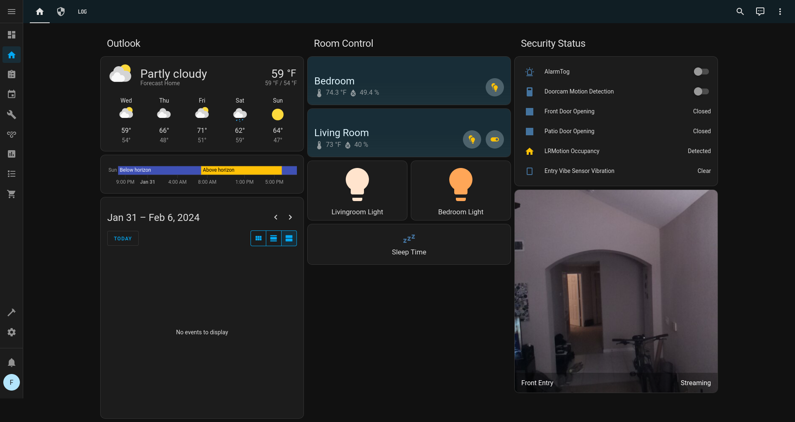

# My Home Assistant Journey

So I've been experimenting, at high cost, with a few different home security platforms and have taken various steps at securing or isolating the devices all to find sacrifices I wasn't willing to make or running into quality and reliability issues. I don't have too many requirements, I don't want or need to fully automate my home, door and motion sensors are optional; I'd ideally like good camera coverage with recording and motion detection alerts that doesn't require cloud connectivity (the biggest ask of all).

To get into what I've tried, and to challenge my recollection of thoughts and issues on past configurations, I'm detailing what I can recall below.

| Vendor | Pro's | Con's | Comments |
| --- | --- | --- | --- |
| Wyze | Fair prices. US hosted cloud. | Battery life on cameras is mediocre. Dropped support for RSTP firmware. Limited device offering. | Didn't like the lack of privacy mode on cameras. |
| Eufy (Anker) | Good prices for quality cameras, easy setup. | Cloud dependencies, limited device offerings. | I like Anker, but there've been untrustworthy responses to vulnerabilites and I'm not quick to trust Chinese tech companies. |
| Kasa (TP-Link) | Easy to setup, reliable, nice app features. | Cloud dependencies. | I like TP-Link devices and use their powerline adapters and LED lights over the expensive Philips gear. |
| Aqara | Huge selection of devices, great prices. | The hub is awful and unreliable, and persistent cloud chatter. | The devices all use Zigbee and are extremely easy to pair to a Home Assistant managed Zigbee network. |
| Philips | Eh. | Price. Requires a hub. | Only experimented with the hub and lights, found Kasa configuration better w/o requiring a hub. |

## Enter Home Assistant

It was a complete accident. I'd tried it out before, long ago, and encountered enough issues I gave up and gave it no mind. But I'd purchased a stack of Aqara door sensors, motion sensors, temperature sensors, air quality sensors, a camera and hub all on discount after hearing both that folks were able to run them with limited cloud connectivity and that there was some success with pairing the devices to Zigbee hubs (with limitations). I gave the hub 17 minutes of time before hating it, and being on a mission at the time I immediately moved to RPi Imager to write Home Assistant to an SD.

The Home Assistant image for Raspberry Pi was dead simple to setup. I purchased the [Sonoff Zigbee 3.0 USB dongle](https://www.amazon.com/gp/product/B09KXTCMSC) over the other options (research led me to believe it worked better with more devices). With it I've had ZERO problems pairing every single Aqara device I've tried. Below are the list of devices I've connected to my setup and aside from some battery drain have had no issues with.

* [Aqara Temp and Humidity Sensor](https://www.amazon.com/gp/product/B07D37FKGY/)
* [Aqara Vibration Sensor](https://www.amazon.com/gp/product/B07PJT939B/)
* [Aqara Door/Window Sensor](https://www.amazon.com/gp/product/B07D37VDM3/)
* [Aqara Mini Switch](https://www.amazon.com/gp/product/B07D19YXND/)
* [Aqara Indoor Air Quality Monitor](https://www.amazon.com/gp/product/B094R8RBWT/)
* [Aqara Motion Sensor](https://www.amazon.com/gp/product/B0B9XZ1D51/)
* [Kasa 1000 Lumen Smart Bulbs](https://www.amazon.com/gp/product/B0BQCSC19C/)
* [Kasa Smart Power Strip](https://www.amazon.com/gp/product/B083JKSSR5/)
* [Kasa Smart WiFi Plugs](https://www.amazon.com/gp/product/B06WD6Q8K9/)
* Raspberry Pi Zero 2w running MotionEye OS
* [Adafruit Bluefruit LE Friend](https://www.adafruit.com/product/2267)

I didn't bother myself to find any blog posts or YouTube videos on configurations, beyond seeing what was capable or looking for inspiration, so I didn't follow some norms for my configuration (specifically the configuration of my form of an alarm setup). But I do have a nice dashboard and ticked all the boxes on my needs.

- [x] Global connectivity through Tailscale.
- [x] Presence and motion detection.
- [x] Temperature, humidity, and AQI monitoring.
- [x] NFC tags and multi-mode clicker buttons to toggle light scenes.
- [x] On-prem only camera with motion detection and recording.
- [x] Alarm toggle with push notifications to the HA mobile app.
- [x] CalDAV to sync calendar events from my email server.
- [ ] Geolocation and tracking. TBD.

## Screenshots
After seeing all the data I have access to and all the connectivity options available, I immediately took to redesigning my home dashboard 3 nights in a row, finally landing on a page that would give me a daily outlook, breakdown of bedroom lights/temp, and security controls.

