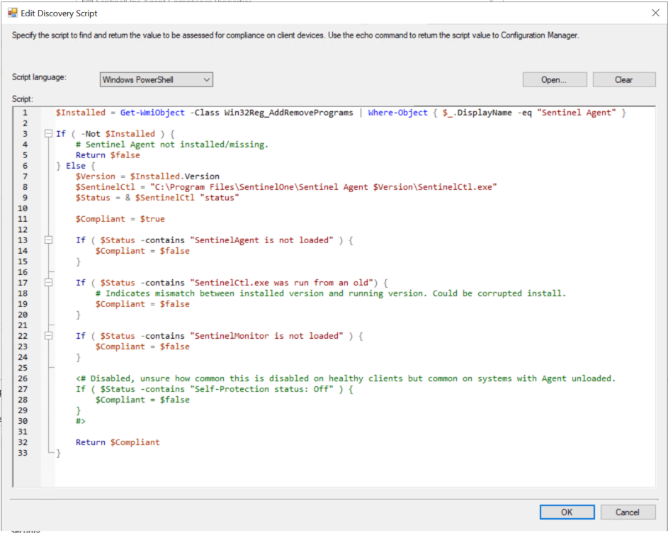
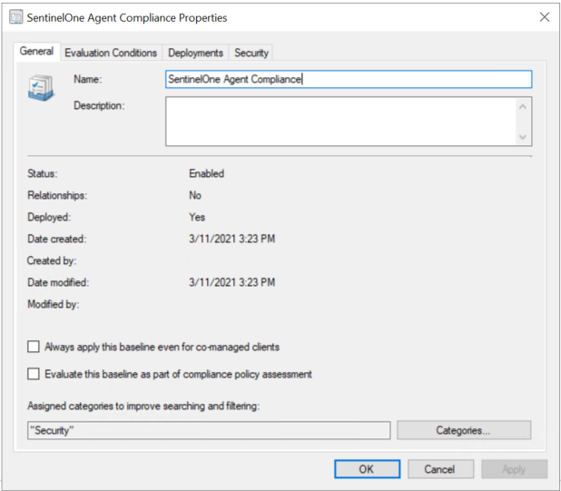
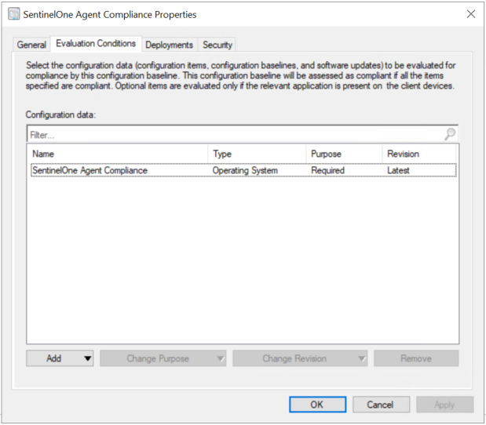
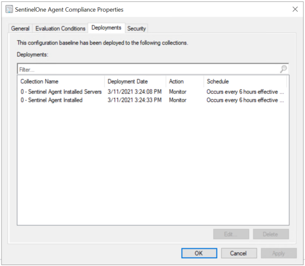
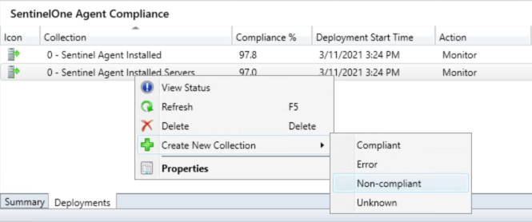

# SCCM Baselines for SentinelOne

After a recent deployment to upgrade our SentinelOne agents I noticed a few unusual issues with agents; Agents offline in console, unresponsive agent module in Sentinelctl, SentinelAgent Windows service stuck in starting state. This may be specific to my organization's environment, or our deployment method, but may also be due to changes to Anti-Tamper that restrict the use of 3rd party deployment tools through agents 4.6.2 - 4.6.12. On these systems the `SentinelCtl.exe status` command told me everything I needed to know, where the Agent Health and Required Actions categories within the Console didn't reflect any problems. So I set out to create baselines within Microsoft Configuration Manager so that we could keep an eye out for these issues.

_I feel it's necessary to mention that the issues described above are not a normal occurance, I'd never seen these issues myself with previous agent versions, and that our issues were resolved by either upgrading and rebooting or doing clean installs on systems that had been upgraded using SCCM when Anti-Tamper protection explicitly prevented it (causing corrupted agent installation)._

_**Update 4/5/2021:** Added a compliance script for [evaluating systems](https://gist.github.com/keyboardcrunch/5da6b14a299c7c78c0699613fe7e27bb) that haven't rebooted since a SentinelOne Agent install or upgrade._

## Creating the Configuration Item
### Step 1 - Create the CI

### Step 2 - Create a New Setting

### Step 3 - Edit the Discovery Script
Next step is to edit the Discovery Script. My method was to detect the installed version of SentinelOne by enumerating the Win32Reg_AddRemovePrograms WMI object so we know the execution path for SentinelCtl for running the `./SentinelCtl.exe status` command, where we then parse the output. _You may want to uncomment the final block validating tamper protection. I had it turned off for an SCCM deployment and to make repairing corrupted installs a bit easier._

You can find my Powershell script [here](https://gist.github.com/keyboardcrunch/6c2451815eb48c42bc3efbc01a809a9d).

### Step 4 - New Compliance Rule
The rule evaluates the data returned from the script, and the script is returning a simple Boolean value for overall compliance (It isn't telling you which component is out of compliance).

## Creating the Configuration Baseline 

### Step 1 - Create a New Baseline

### Step 2 - Add the Previous Configuration Item
Here we're just adding the previously created Configuration Item to tell the Baseline what to evaluate.

### Step 3 - Deploy the Baseline
This will look different when created through the wizard workflow, but in this step you're just creating a deployment to any device collection you wish. I have a separate collection for devices missing the SentinelOne agent, so I'm only deploying this baseline to a collection of systems with SentinelOne installed, running evaluation every 6 hours (personal preference), and in Monitor mode since remediation would be too complex to automate with anti-tamper and per-agent passwords.

#### Step 4 - Create a Non-Compliant Collection (optional)
This step is completely optional, but you can right-click on any baseline deployment and create a collection of Non-Compliant systems (and it will refresh depending on the collection settings). This is useful for reporting, but you could always review results from the Monitoring tab of SCCM.

## Wrap-up
I just want to add a final disclaimer that this may be completely unnecessary but I have found it necessary for discovering corrupted agent installs, and it has come in handy in verifying test deployments of agent upgrades as I've noticed (rare) instances of upgraded agents going offline after becoming unresponsive 12hrs-days after upgrade where they just needed to reboot after upgrade.

Additionally, with a little bit of work the above Powershell script could be repurposed to dump granular configuration data with SentinelCtl for validation of Policy Override settings or even Management Connection status. 

I've also started reviewing my environment for systems that haven't rebooted since SentinelOne Agent upgrade or installs with [this script](https://gist.github.com/keyboardcrunch/5da6b14a299c7c78c0699613fe7e27bb), because there have been instances where these types of systems have been missing EDR data or failed remediation/kill tasks for one reason or another.