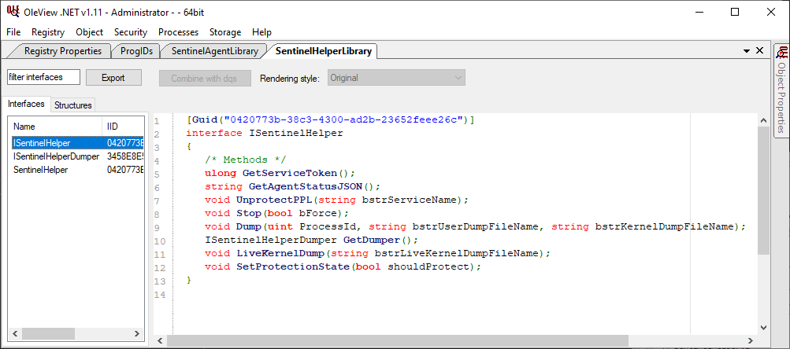

# Hacking A Better SentinelOne

One of my few frustrations with modern EDR tooling are that most all of them have thrown out one of the most useful features of the legacy anti-virus, scanning of USB drives. They're a vector for malicious files onto the network, files that could migrate to other places in your network before they're ever analyzed, and this can possibly be an issue with compliance regulations (or at least a frustrated CISO as I experienced). So cool, USB content is ignored until it's written somewhere else... Guess what? EDR's like Crowdstrike and SentinelOne don't do on-write scanning for SMB/NFS (usually just on-execute). Now if you work with a lot of vendors with software, firmware, and documents then you'll know it's best to get those off USB and onto a network share. So let's abuse a feature of SentinelOne to add on-connect USB device scanning.

### The Lead
Within the SentinelOne /docs we can see that the Sentinel Agent implements a COM server with a few methods that can be used to create a custom application (like a tray application). The documentation mostly makes references to threat and infected status, and the documentation and sample code provided is lacking. So let's just start digging here.

### James Forshaw's OleView
Since we know the Program ID to investigate, [OleView](https://github.com/tyranid/oleviewdotnet) is a good place to start. We start by navigating to the "Prog IDs" section under the Registry menu. The documentation references `SentinelAgent.1`, so let's start by opening the Type Library of ISentinelAgent (as it's the most obvious).


### Prototyping Some Code
Above, we can see that DSentinelAgentEvents exposes a few methods, the one we care about happens to be the `OnDeviceControlEvent` which looks to spit out a Json object. So let's prototype some Python code using [pywin32](https://pypi.org/project/pywin32/) that will connect a COM client to SentinelAgent.1 and dump a Device Control event.

```python
import json
import win32api
import win32com
import win32com.client
import pythoncom

class AgentEvents:
    def OnDeviceControlEvent(self, event):
        device_event = json.loads(event)
        print(json.dumps(device_event), indent=4, sort_keys=True) # print the event

agent = win32com.client.DispatchWithEvents("SentinelAgent.1", AgentEvents)
pythoncom.PumpMessages()
```
Below are the results we get for a USB connection.
```json
{
    "deviceClass": 8,
    "deviceName": "SanDisk Cruzer Blade",
    "eventId": "{96e5a854-abb7-11ec-ba75-000c29ad0249}",
    "eventType": "connected",
    "interface": "USB",
    "productId": 21863,
    "ruleId": "-1",
    "serialId": "4C530110050104113372",
    "timestamp": "2022-03-24T21:19:00.894+00:00",
    "vendorId": 1921
}
```

A little unfortunate that it doesn't contain the drive letter or mount path, but we can at least piggyback off this connection event, and we can see a way forward for filtering on events to just Class=8 (mass storage) and Type=connected; we could even filter out trusted USB devices by `serialId` if we wanted to.

Let's add `win32file` to our imports and just do a bit of drive enumeration.
```python
if device_event["eventType"] == "connected" and device_event["deviceClass"] == 8:
    drives = win32api.GetLogicalDriveStrings().split('\x00')[:-1]
    for device in drives:
        drive_type = win32file.GetDriveType(device)
        if drive_type == win32file.DRIVE_REMOVABLE:
            print("We need to scan the %s drive", device)
```

### Scanning the Drive

So now we have some basic code that will run and wait for a USB device connection, if it's a 'connected' event for a removable storage drive it'll print out _"We need to scan the X:\ drive"_. So let's figure out how we'll trigger the scan. We know we can scan files or folders using SentinelCtl commands (we are good SentinelOne administrators), and with a bit of testing we can confirm that it doesn't require administrative priviledges to initiate a scan, so our problem is locating the binary.

My first swing at this uses yet more Sentinel COM hackery, as I know that `SentinelHelper.1` has a `GetAgentStatusJSON` method that will return a bunch of information about the agent. The downside, it requires administrative priviledges, so we'll need to find a better method later.



We really just want the full path to the SentinelCtl.exe binary, so we need to grab the currently installed agent version to know the path. And since we have the device drive/mount path as the `device` variable, we can just mock up the full execution of the scan. It's good to test this to see if we'll have any pop-up from the agent for these scans.

```python
import win32com
import win32file
import subprocess

# Find the running agent version and craft full path for SentinelCtl.exe
agent_com = win32com.client.Dispatch("SentinelHelper.1").GetAgentStatusJSON()
agent_info = json.loads(agent_com)
sentinelctl = "C:\Program Files\SentinelOne\Sentinel Agent %s\SentinelCtl.exe" % agent_info["agent-version"]

# Execute SentinelCtl.exe scan_folder -i device
scan_status = subprocess.run([sentinelctl, 'scan_folder', '-i', device], stdout=subprocess.PIPE).stdout.decode('utf-8')
```

Testing this I saw no pop-ups or activity from the tray icon, and the scan_status simply states that the scan was initiated. So what if a scan was already running, well... sadly a new scan request will fail, but SentinelCtl provides a `is_scan_in_process` command that will state _"Scan is in progress"_ if one is already going, so maybe our end code should kill any running scans?

### The Prototype
With the above code we can successfully monitor for new USB mass storage devices being connected, and initiate a scan with SentinelCtl on that drive, while handling some specific behavior regarding running scans. [usbscan.py](https://github.com/keyboardcrunch/sentinelone_usbscan/blob/main/usbscan.py) is just a quick proof of concept, but I've thrown in some logging and the ability to run completely without any administrative priviledges. I won't cover it here, but next steps are to compile and sign a Windows binary and install it as a low priviledged service.